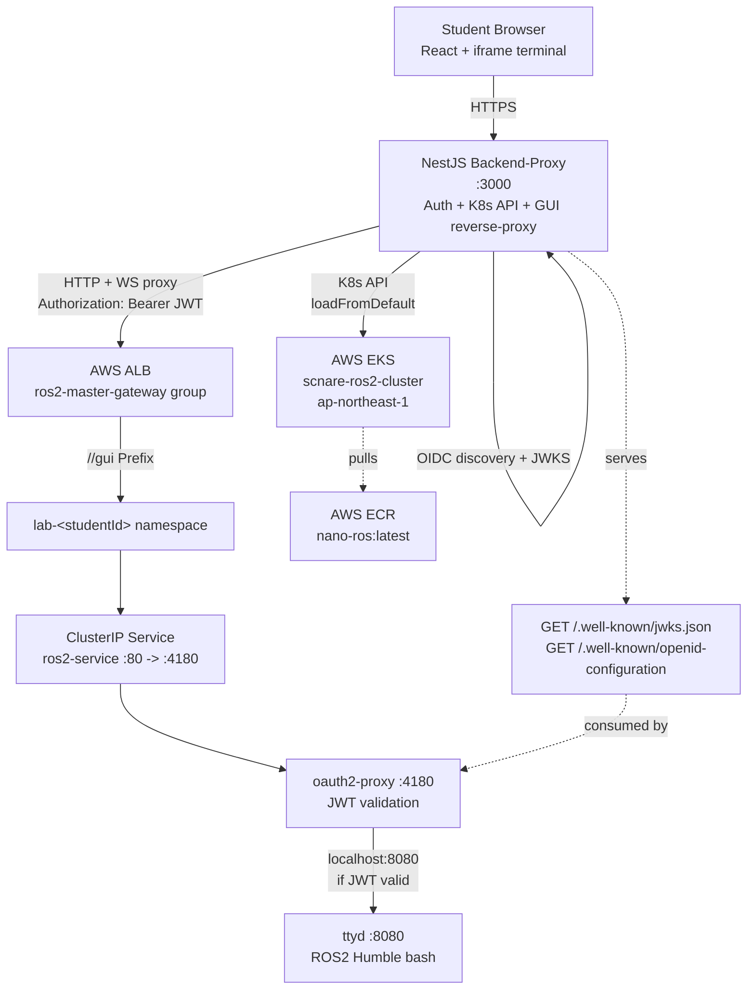
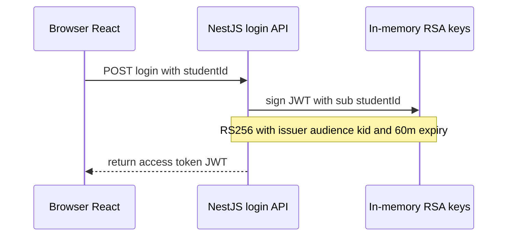
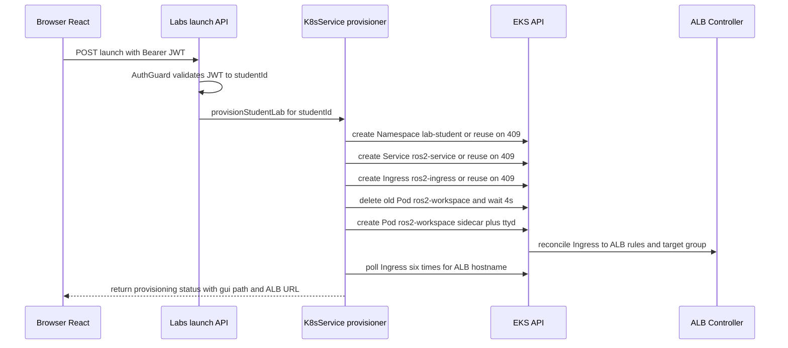
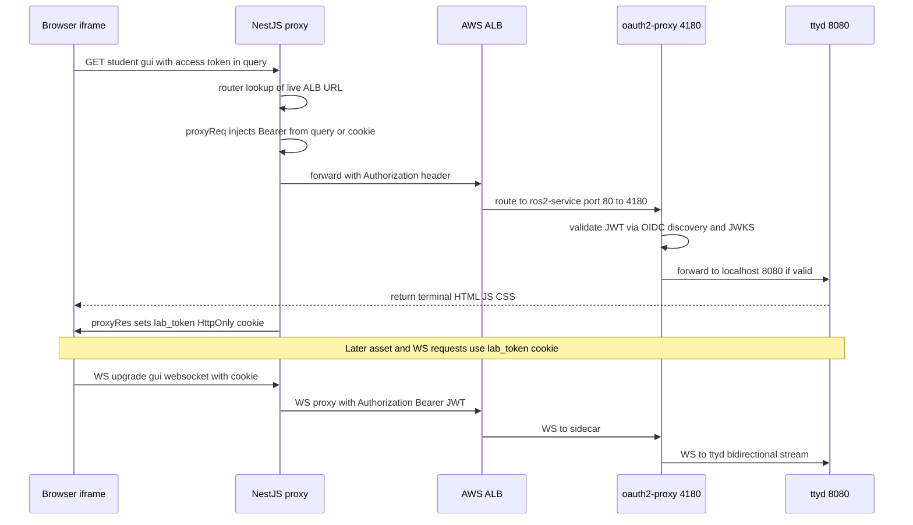
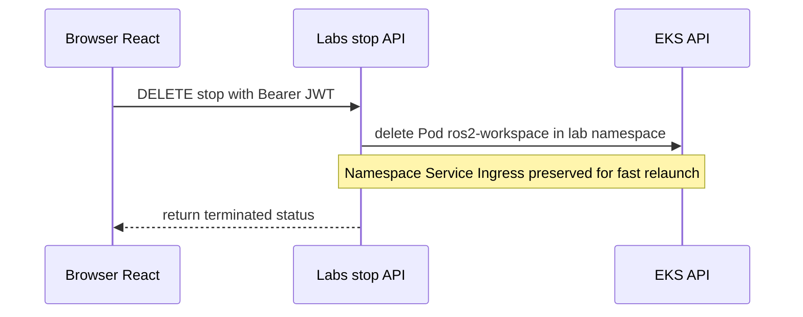
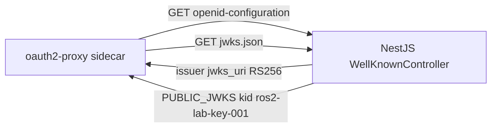
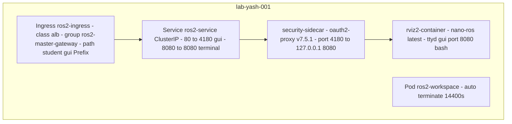

# ROS2 Lab Platform — Architecture & Flow

> Stack: React (Vite) frontend + NestJS backend-proxy + AWS EKS + ALB + ECR + OAuth2-Proxy + ttyd/ROS2 Humble
> Cluster: `scnare-ros2-cluster`, `ap-northeast-1` (Tokyo), K8s `1.30`
> Doc generated from: `README.md`, `backend-proxy/src/**`, `frontend/src/App.tsx`, `infrastructure/cluster.yaml`, `docker-image/Dockerfile`, `iam_policy.json`

---

## 1. System Overview

Per-student isolated ROS2 lab environments on AWS EKS, accessed from the browser. The NestJS backend is both the **control plane** (auth + K8s provisioning) and the **data plane** (reverse proxy for terminal HTTP + WebSocket).

**Core idea:** 1 student = 1 K8s namespace (`lab-<studentId>`) = 1 Pod (oauth2-proxy sidecar + ttyd/ROS2 container) + 1 Service + 1 Ingress rule on a shared ALB group.

---

## 2. High-Level Architecture Diagram

### 2.1 Context diagram (Mermaid)



### 2.2 Network / deployment view (ASCII)

```
                        ┌─────────────────────────────────────────────┐
                        │              Student laptop / browser       │
                        │  React App (Vite)                           │
                        │   - POST /api/auth/login                    │
                        │   - POST /api/labs/launch                   │
                        │   - iframe src=<backend>/<id>/gui?access_token=... │
                        └──────────────┬──────────────────────────────┘
                                       │ HTTPS (ngrok in dev, domain in prod)
                                       ▼
                        ┌─────────────────────────────────────────────┐
                        │  NestJS Backend-Proxy (port 3000)           │
                        │  backend-proxy/src/                         │
                        │   main.ts ......... /gui proxy middleware   │
                        │   auth/ ........... login + RS256 + JWKS    │
                        │   k8s/ ............ launch / stop + K8s SDK │
                        └──┬──────────────────┬───────────────────┬───┘
                           │                  │                   │
              K8s API ──────┘                  │ proxy             │ OIDC/JWKS
         (CoreV1Api, NetworkingV1Api)          │ (http-proxy-      │ (self-served)
                                               │  middleware, ws:true)
                                               ▼                   ▼
                        ┌──────────────────────────────────────────────────────┐
                        │  AWS EKS: scnare-ros2-cluster (1.30, t3.medium x1-3) │
                        │                                                      │
                        │  ALB Controller (iam_policy.json)                    │
                        │   └── Shared ALB group: ros2-master-gateway          │
                        │        ├── /yash-001/gui -> lab-yash-001/ros2-service│
                        │        ├── /alice/gui .... -> lab-alice/ros2-service │
                        │        └── ... per-student Prefix rules              │
                        │                                                      │
                        │  Namespace: lab-<studentId> (per student)            │
                        │   ├── Ingress ros2-ingress (class: alb)              │
                        │   ├── Service ros2-service (ClusterIP)               │
                        │   │     :80 -> sidecar :4180                         │
                        │   │     :8080 -> ttyd :8080 (direct/debug)           │
                        │   └── Pod ros2-workspace (activeDeadlineSeconds:14400)│
                        │        ├── security-sidecar (oauth2-proxy:v7.5.1 :4180)│
                        │        │     upstream http://127.0.0.1:8080          │
                        │        └── rviz2-container (nano-ros:latest :8080)   │
                        │              ttyd -b /<id>/gui -p 8080 bash          │
                        │              FROM ros:humble-ros-core + ttyd         │
                        └──────────────────────────────────────────────────────┘
```

### 2.3 Component responsibilities

| Component | Code location | Responsibility |
|---|---|---|
| Frontend | `frontend/src/App.tsx` | `IDLE → PROVISIONING → RUNNING` state machine. Calls `login` → `launch`, embeds terminal in `<iframe>`, calls `stop`. Hardcoded backend base URL + `studentId`. |
| Auth | `backend-proxy/src/auth/auth.module.ts`, `auth.keys.ts`, `jwt.strategy.ts`, `well-known.controller.ts` | In-memory 2048-bit RSA keypair at boot. `POST /api/auth/login` signs RS256 JWT (`iss`, `aud=ros2-lab-platform`, `kid=ros2-lab-key-001`, `exp=60m`). Passport `JwtStrategy` guards lab APIs. Serves OIDC discovery + JWKS. |
| Lab controller | `backend-proxy/src/k8s/k8s.controller.ts` | `POST /api/labs/launch`, `DELETE /api/labs/stop`. `AuthGuard('jwt')`, extracts `studentId` from `req.user.studentId/userId/sub`. |
| Lab provisioner | `backend-proxy/src/k8s/k8s.service.ts` | `provisionStudentLab()`, `terminateStudentLab()`, `getMasterGatewayUrl()`, `getLabUrl()`. Idempotent create-if-absent for Namespace/Service/Ingress, force-recreate Pod, poll ALB hostname 6×4s. |
| GUI proxy | `backend-proxy/src/main.ts` | `http-proxy-middleware` mounted on any path containing `/gui`. Dynamic `router` → live ALB URL. `proxyReq`/`proxyReqWs` inject `Authorization: Bearer <token>` from `?access_token=` or `lab_token` cookie. `proxyRes` sets `lab_token` HttpOnly cookie. |
| Infra | `infrastructure/cluster.yaml` | `eksctl` VPC + managed node group (`t3.medium`, 1–3 nodes, `imageBuilder:true` for ECR pull). ALB Controller IAM in `iam_policy.json`. |
| Lab image | `docker-image/Dockerfile` | `ros:humble-ros-core` + `ttyd`, sources ROS env, `CMD ["ttyd","-p","80","bash"]` (overridden in K8s to `-b /<id>/gui -p 8080 bash`). |

---

## 3. End-to-End Flows

### 3.1 Flow 0 — Login (JWT issuance)



Code: `backend-proxy/src/auth/auth.module.ts:11-18`, keys in `auth.keys.ts:1-24`.

### 3.2 Flow 1 — Launch lab (provisioning lifecycle)



Details (`k8s.service.ts:61-270`):

1. **Namespace** `lab-<id>` — isolation boundary. Created once, reused.
2. **Service** `ros2-service` (ClusterIP): `gui: 80→4180`, `terminal: 8080→8080`, selector `app=ros2-student-lab, student=<id>`.
3. **Ingress** `ros2-ingress` (`ingressClassName: alb`): `scheme=internet-facing`, `target-type=ip`, `group.name=ros2-master-gateway`, `healthcheck-path=/oauth2/healthz`, rule `path=/<id>/gui (Prefix)` → `ros2-service:80`.
4. **Pod purge**: delete `ros2-workspace` + 4s drain so relaunch always starts clean.
5. **Pod create** `ros2-workspace` (`activeDeadlineSeconds: 14400` = 4h auto-kill):
   - `security-sidecar`: `quay.io/oauth2-proxy/oauth2-proxy:v7.5.1`, `--http-address=0.0.0.0:4180`, `--upstream=http://127.0.0.1:8080`, `--provider=oidc`, `--oidc-issuer-url=https://<backend>`, `--client-id=ros2-lab-platform`, `--skip-jwt-bearer-tokens=true`, `--extra-jwt-issuers=<iss>=ros2-lab-platform`, `--oidc-email-claim=sub`, `--email-domain=*`, `--set-authorization-header=true`, health `/oauth2/healthz`. CPU `100m/200m`, RAM `128Mi/256Mi`.
   - `rviz2-container`: `221131121759.dkr.ecr.ap-northeast-1.amazonaws.com/nano-ros:latest`, `ttyd -b /<id>/gui -p 8080 bash`, CPU `500m/1000m`, RAM `1Gi/2Gi`, `drop:[ALL]`, no priv-esc.
6. **ALB poll**: up to ~24s for `ingress.status.loadBalancer.ingress[0].hostname`.

Frontend (`App.tsx:13-49`): `PROVISIONING` → `login` → `launch` with `Bearer` → stores `access_token`, `internalPath`, `albUrl` → `RUNNING`.

### 3.3 Flow 2 — GUI proxy (HTTP + WebSocket terminal)

This is the data plane. Browser never talks to the ALB directly; everything goes through NestJS so the JWT can be injected server-side.



Key code (`main.ts:13-74`):

- `router` is async per-request → `K8sService.getMasterGatewayUrl()` scans `lab-*` namespaces for first Ingress with ALB hostname.
- `proxyReq`: reads `req.query.access_token`, falls back to `lab_token` cookie, sets `Authorization`.
- `proxyRes`: persists query token into `lab_token` HttpOnly cookie for JS/CSS/WS follow-ups.
- `proxyReqWs`: same injection for WebSocket upgrades (ttyd needs it).
- Mount condition: `req.path.includes('/gui')`.

Frontend iframe (`App.tsx:118-125`): `src=<backend><internalPath>/?access_token=<token>`, `key={terminalKey}` allows manual refresh.

### 3.4 Flow 3 — Stop lab



Code: `k8s.service.ts:272-288`, `k8s.controller.ts:26-36`, frontend `App.tsx:51-79`.

### 3.5 Flow 4 — OIDC discovery (sidecar trust bootstrap)



Code: `well-known.controller.ts:8-23`, `auth.keys.ts:15-24`. Note keys are **in-memory per backend restart** — sidecar must re-discover after backend reboot; JWTs signed before reboot become invalid.

---

## 4. Per-Student Namespace (detail)



Isolation properties: separate namespace per student; pod-level `activeDeadlineSeconds` auto-terminates after 4h; container `drop:[ALL]` + `allowPrivilegeEscalation:false` on workload container; per-student Ingress path prevents cross-student routing (auth still enforced by JWT `sub` → namespace mapping server-side).

---

## 5. Token Lifecycle & Trust Chain

| Stage | Value | Lifetime | Where |
|---|---|---|---|
| RSA keypair | 2048-bit, in-memory (`generateKeyPairSync`) | Backend process lifetime | `auth.keys.ts` |
| JWKS | `{ kid: ros2-lab-key-001, alg: RS256, use: sig }` | Same as above | `GET /.well-known/jwks.json` |
| Access token | RS256 JWT, `sub=studentId`, `iss=<backend>`, `aud=ros2-lab-platform` | `60m` (`expiresIn`) | `POST /api/auth/login` → `Authorization: Bearer`, `?access_token=`, `lab_token` cookie |
| Lab pod | `activeDeadlineSeconds: 14400` | 4h max | EKS |
| Cookie | `lab_token=<jwt>; HttpOnly; SameSite=None; Secure` | Mirrors JWT | Set by proxy on first `/gui` hit |

Trust: `login` signs → `JwtStrategy` verifies API calls → proxy re-injects Bearer → `oauth2-proxy --skip-jwt-bearer-tokens + --extra-jwt-issuers` verifies against JWKS → `ttyd` serves.

---

## 6. Infrastructure & Build

- **EKS** (`infrastructure/cluster.yaml`): `scnare-ros2-cluster`, `1.30`, VPC public+private endpoints, `standard-nodes` (`t3.medium`, 1–3, 20GB, `imageBuilder:true` for ECR pull).
- **ALB Controller**: IAM in `iam_policy.json` (ELB + EC2 + ACM + WAF/Shield). `target-type: ip`, `internet-facing`, shared group `ros2-master-gateway` → one ALB, many Ingress rules.
- **ECR**: `221131121759.dkr.ecr.ap-northeast-1.amazonaws.com/nano-ros:latest` built from `docker-image/Dockerfile` (`ros:humble-ros-core` + `ttyd` + ROS sourcing).
- **Backend run**: `npm run start:dev` / `build` + `start:prod`, `:3000`, `kc.loadFromDefault()` (kubeconfig or in-cluster SA).
- **Frontend run**: `frontend/` Vite + React 19, `dev` / `build` / `preview`.

---

## 7. Failure & Edge Handling (as implemented)

- `409` on Namespace/Service/Ingress create → treated as "already exists", relaunch is idempotent.
- `404` on Pod delete → treated as "already gone" (first launch / already stopped).
- ALB hostname absent → poll 6×4s, return `albUrl: null` if still pending; frontend still proceeds via `internalPath` through backend proxy.
- Proxy target unresolved (`getMasterGatewayUrl() == null`) → fallback `http://localhost:8080`; proxy errors → `502 { error: Proxy error }`.
- Backend restart → new RSA keypair → old JWTs invalid, sidecar must refetch JWKS.

---

## 8. File Map (relevant to diagram)

```
backend-proxy/src/main.ts ................. bootstrap + /gui proxy (router, proxyReq/Ws/Res)
backend-proxy/src/app.module.ts ........... wires AuthModule + K8s + WellKnown controllers
backend-proxy/src/auth/auth.module.ts ..... POST /api/auth/login (RS256 sign)
backend-proxy/src/auth/auth.keys.ts ....... in-memory RSA + PUBLIC_JWKS
backend-proxy/src/auth/jwt.strategy.ts .... Passport guard for /api/labs/*
backend-proxy/src/auth/well-known.controller.ts .. OIDC discovery + jwks.json
backend-proxy/src/k8s/k8s.controller.ts ... POST launch / DELETE stop
backend-proxy/src/k8s/k8s.service.ts ..... Namespace/Service/Ingress/Pod lifecycle + ALB lookup
frontend/src/App.tsx ...................... login → launch → iframe terminal → stop
infrastructure/cluster.yaml ............... EKS cluster + node group
docker-image/Dockerfile ................... ROS2 Humble + ttyd image
iam_policy.json ........................... ALB Controller IAM permissions
```

---

## 9. How to Read the Mermaid Diagrams

Paste any `mermaid` block into GitHub, Notion, or https://mermaid.live to render. The ASCII diagram in §2.2 is copy-paste safe for docs/slides.
